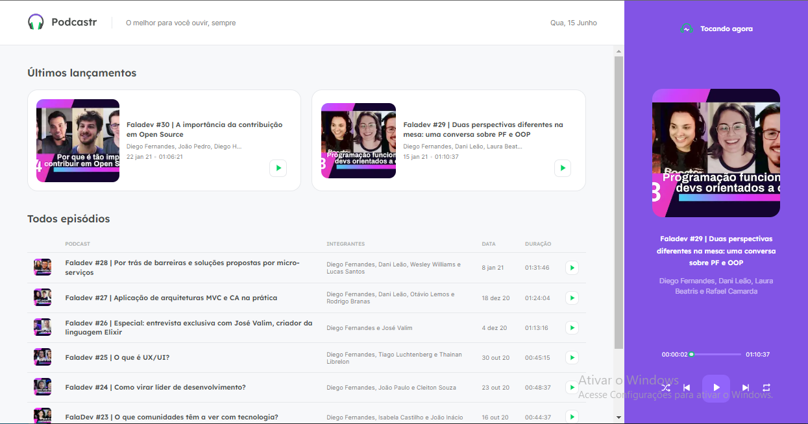

  

## 💻 Projeto

O podcastr é um app para reprodução de episódios em áudio do seu podcast favorito.

> Este projeto foi desenvolvido apenas para fins de aprendizagem e vem do evento NLW da Rocketseat com minhas próprias modificações.

## ✨ Tecnologias

Esse projeto foi desenvolvido com as seguintes tecnologias:

- [React](https://reactjs.org)
- [Next.js](https://nextjs.org/)
- [TypeScript](https://www.typescriptlang.org/)

## 🚀 Como executar

- Clone o repositório
- Instale as dependências executando o comando `yarn` ou `npm install`
- Inicie a fake api executando o comando `yarn server`
- Inicie o servidor executando o comando `yarn dev`

Agora você pode acessar o endereço [`localhost:3000`](http://localhost:3000) no seu navegador.

# License

[MIT License](/LICENSE)
